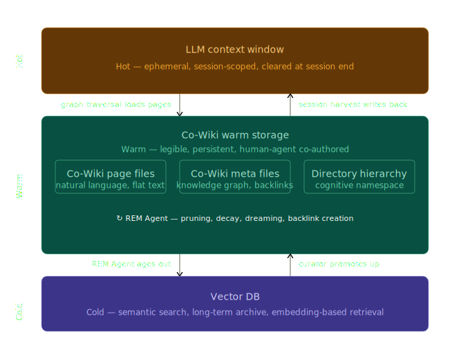

# The Co-Wiki and REM Agent:  
## A Legible Memory Architecture for the Second Brain

There’s no way the current LLM chat interface is a dominant design. It’s inconceivable chat threads will house human-AI discussions in 5 years. I’d say the same of flat-RAG architectures, built without a prominent warm storage layer. 

I have no issue with vector DBs as cold storage. Yet a *legible* warm storage is actually the backbone of the "second brain." This era’s implied promise of delegating our thinking to a personal AI, and *always having top-of-mind, and adjacent information in its extended memory.* 

## Confronting Flat-RAG and Chat Hell
Chat hell is when knowledge evaporates from LLM chats, without a clear harvest workflow. It’s when project containers fail to corral spaghetti piles of threads \-- each with crown jewels and referenceable information hiding under mountains of slop. Chat hell is the lack of workflows for managing quantity and redundancy. It’s zero editing, merging, or versioning. 

The chat workflow did successfully invite humans to converse with AI. Yet long term, the chat interface may be the worst of all content design patterns.

The Co-Wiki doesn't replace RAG cold storage — it provides the warm layer for LLM memory, designed for human-agent co-authorship. It makes RAG dramatically more effective by pre-processing semantic boundaries and knowledge relationships before they reach the vector index.

RAG architectures without warm storage have issues. For one, they’re not human readable. Secondly, RAG chunking algorithms don’t make sense, despite all the engineering efforts behind them. RAG must move data in chunks, yet always seems to create them on artificial boundaries, never with reference to the underlying content. 

Even stranger, RAG defaults to a single chunking approach \-- often 512-token slices. Not ideal across heterogeneous data such as books and social media posts. 

The Co-Wiki addresses each of these failures directly.

## The Co-Wiki: a Storage Philosophy for the Second Brain   
The Co-Wiki was inspired by Andrej Karpathy’s “LLM Knowledge Base.” It introduced a wiki workspace accessed by agentic processes for maintenance, health checks, and to find new connections and introduce backlinks. 

Yet Karpathy is an Obsidian user and summarized his design as, “Obsidian is the IDE, the LLM is the programmer, the wiki is the codebase.” 

Karpathy didn’t endeavor to break out of chat hell and isn’t trying to reimagine warm storage, but the Co-Wiki does. Its architecture is foundationally grounded in the wisdom of wikis. 

The wiki is *the* dominant design for all-in-one reading, navigation, editing, approval, and versioning workflows. Highly underrated is the wiki’s organic knowledge chunking.

The Co-Wiki proposed here is a flat and brutally simple architecture. The wiki is a legible memory layer. *It is warm storage.* It dreams of dramatically reducing vector DB reads, but its priority lies in presenting natural language and reducing human cognitive load.   

Here is the Co-Wiki design philosophy:

### Legibility and co-authorship of warm storage are paramount  
Legible memory is not an LLM optimization, don’t be confused. The Co-Wiki is not optimized from a token usage or storage perspective. It’s human optimized and scales to personal usage.

Legible memory is analogous to human declarative memory, which contains accessible language that’s consciously and explicitly available. Unlike the vector DB, but like our own declarative memory, the user can directly read from the Co-Wiki. 

The Co-Wiki is the warm storage to load LLM chatbot and agent context windows as well. Again, a flat and brutally simple architecture.

The chat session is the backbone of the Co-Wiki. At the end of a chat session, valuable information is harvested into related Co-Wiki articles. During chat sessions, the user and LLM might decide to "spinoff or fork" content together \-- though a curation agent would also exist to do this in the background.

Unlike the serial LLM chat, a major workflow is *human editing of any past Co-Wiki content*. This workflow is another opportunity for LLMs to aid in article writing, commits, merges, or splits.

The principle of co-authorship means multiple agentic tasks can edit, generate content, or perform large modification requests inside the Co-Wiki \-- with approvals. 

Editing, versioning, and logging arrive free with many wiki codebases. Auditing is paramount considering the privacy and security implications.

### Backlinks and categories become first class citizens  
Backlinks deeply parallel the mind’s “cognitive associations,” connecting relevant knowledge. It’s no accident academic citations and Google’s PageRank became classics. 

Wikis, like Wikipedia, also represent a dominant design in organizing human knowledge with navigable backlinks and categorical browser navigation. 

Co-authorship means both Co-Wiki agents and humans organize data by page creation, backlinks and categorical taxonomies.

### Let human cognition and social consensus chunk data   
Humans naturally create and organize knowledge for reading, and in the case of article size, that means creating read-sized chunks. It also means letting them group articles in comprehensible categories. 

Why set chunk boundaries at token counts or paragraph breaks, when it can be set as an idea achieves sufficient closure. The Co-Wiki leverages the edge of human cognition.

### An organic knowledge graph beats one-size-fits-all chunking   
Many wiki codebases hold lists of backlinks, content categories, and page properties in flat metadata files. Reading these files loads a tight knowledge graph organically connecting content pages with backlinks and meta categories. 

This knowledge graph allows LLMs to not only know available pages, but dynamically load context like the human mind’s Spreading Activation process. Cues activate an article, backlinks traverse and spread to connected nodes, the most strongly connected and recently activated pages surfacing first. 

The Co-Wiki’s biomimicry is not unique in storage schemes, see the MIRIX memory research framework. A-Mem also leverages interconnected knowledge networks through dynamic indexing, linking, and contextual descriptions. Yet neither A-Mem nor MIRIX explicitly store legible language.

## LLM Integration Without APIs or Infrastructure Deployment  
The best part is it may require zero infrastructure or APIs to connect your LLM-chatbot and agents to the Co-Wiki.

I’ll leave the reader to pick an open source wiki codebase to start from. Relevant research is highlighted below, please verify\!

Consider how the wiki codebases and their backends work today. Outside MediaWiki (Wikipedia), DokuWiki is the next most deployed, targeting private, internal, and personal deployments. TiddlyWiki is another.

Coincidentally, Andrej Karpathy’s choice of Obsidian Vault resembles DokuWiki’s back end. Each keep pages as flat files (\*.txt or \*.md), stored in directory structures with categorically named folders. Reading the folder names builds the namespace. 

Consider how profound an LLM integrated with a flat file backend is. They can be directly connected through the filesystem, aka “ls” command and reads. No API or infrastructure deployment is required between the agent/LLM and warm storage.

A lightweight preprocessing step converts DokuWiki's .meta files into human-readable companion files — run once, updated incrementally. Prompting an LLM to navigate the directories and files will then load a full knowledge graph with minimal tokens.

This is what’s meant by API-less and without infrastructure deployment.

The Co-Wiki’s selective context loading is essentially free compared to the semantic search of embeddings in RAG. 

## Problem of Agent Read/Write Asymmetry   
Reading wiki backend files from the filesystem is fast, cheap, API-less, and has no concurrency issues. Yet writing is more complex.

Wiki co-authorship typically implements an optimistic concurrency model. Anyone can edit and conflicts are resolved afterwards through diffing and merging \-- no preventative locking. 

Some operations need concurrency protections. Think atomic operations like renaming a page, updating backlinks across multiple files, deprecating a concept that's referenced in twelve places. 

Maybe v1.0 just locks the user out while the agent performs short tasks. User approval of edits has a place. There’s also performing curation tasks when the user isn’t present (second brain sleep).

## REM Agent   
Wikis have a reputation for high maintenance. The Wiki Gardening Problem \- bloat, stale pages, broken backlinks, and the need for brand new backlinks. In the Co-Wiki, these represent an opportunity to design the REM Agent.

A REM Agent must implement pruning and decay to clean out gunk, eliminate redundancy, irrelevance, and age out content during sleep. REM also needs a dreaming algo to locate new connections and create backlinks, and even add new content. Eureka\!

The REM Agent’s pruning, decay and dreaming algo are intimidating to build. This doc doesn’t design them, only provides an architecture to start on. 

Personally I’d biomimic known cognitive processes during REM sleep. Novelty, Emotional Salience, and Contextual Association (backlinks) imply memories \-- or here pages \-- have staying power. Decay Theory might offer a fading algo.

Page access is the cognitive concept called Repetition. The user repeating information for better retainment is Rehearsal. What about the Motivated Forgetting of pages causing cognitive dissonance? Deprecate, redirect, or keep, LOL.

The first Co-Wiki deployment is a serious experiment in human memory. How large is an individual's top-of-mind adjacent knowledge when externalized? We’ve never measured it. And once it can be externalized, is the craving to continually extend the mind unquenchable?

[Also see Frequently Asked Questions (FAQ)](FAQ.md)

## Invitation to Build   
I'm an independent researcher in the middle of a series of papers and a book on applied “edge epistemology.” I have too many time commitments to ship and maintain code. Someone else needs to build this before it’s too late.

So here's the design. The first to ship owns the category. If you build it, all I ask is to cite this document and use some of my verbiage. 

Paul Shomo  
Independent Researcher  
[LinkedIn](https://www.linkedin.com/in/paulshomo/) | [@ShomoBits](https://x.com/ShomoBits)
